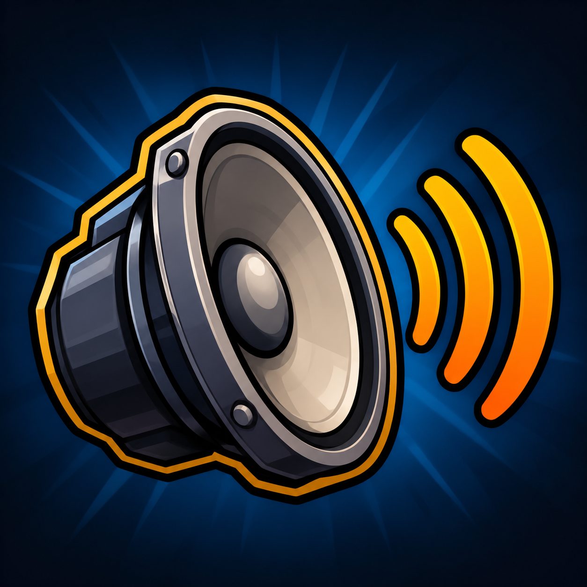

# General Game Sounds Addon Pack

## Addon Summary

A collection of general-purpose game sound effects that adds more variety and personality to in-game alerts, interactions, abilities, combat, and user-interface events.

## Addon Description

**General Game Sounds Addon Pack** is an unofficial sound addon that brings together audio effects from different game styles to enhance everyday gameplay feedback.

The pack includes sounds intended for general use, such as notifications, user-interface feedback, interactions, abilities, combat moments, ambient events, and other common in-game actions. Its goal is to provide a more expressive and varied audio experience through recognisable effects from different games.

## Disclaimer and Rights Notice

This is an unofficial, non-commercial, fan-made addon. It is not affiliated with, endorsed by, sponsored by, approved by, or associated with Blizzard Entertainment, New Blood Interactive, Arsi "Hakita" Patala, or any other developer, publisher, or rights holder mentioned or referenced in this project.

## Third-Party Audio Assets

This addon currently includes sound effects originating from or associated with the following games:

- **World of Warcraft®**
- **ULTRAKILL**

All rights, titles, copyrights, trademarks, audio assets, game names, logos, characters, and other intellectual property related to these games remain the property of their respective owners and rights holders.

No ownership, licence, permission, endorsement, or affiliation regarding these third-party audio assets is claimed by the author of this addon. The audio assets are not included under the proprietary-code claim described below.

`World of Warcraft` and `Warcraft` are trademarks or registered trademarks of Blizzard Entertainment, Inc., in the United States and/or other countries.

## Generative-AI Image Notice

The cover image, thumbnail, and/or promotional artwork for this addon was created with the assistance of generative AI.

Generative AI was used exclusively for visual artwork. It was **not** used to create the addon's source code, configuration, logic, functionality, structure, or technical implementation.

## Proprietary Code and Implementation

Unless a separate licence explicitly states otherwise, all original elements created specifically for this addon are proprietary and remain the intellectual property of the author.

This includes, but is not limited to:

- Source code
- Addon logic and functionality
- Configuration files
- File and folder structure
- Technical implementation
- Original documentation and written content

This proprietary claim applies only to original work created for this project. It does not apply to third-party audio assets, game names, trademarks, logos, or any other content owned by its respective rights holders.

No permission is granted to copy, redistribute, modify, reverse engineer, republish, or commercially exploit the proprietary portions of this project without prior written permission from the author.

## Non-Commercial Use

This addon is shared for non-commercial fan and personal-use purposes only. It is not intended to replace, reproduce, compete with, or imply an official relationship with the original games or their creators.

## Rights Holder Requests

If you are a rights holder, or an authorised representative of one, and believe that material included in this addon infringes your rights, please contact the author with sufficient information to identify the relevant content. The material can then be reviewed and removed where appropriate.

## Contact

For copyright, content-removal, or rights-related requests:

- **Author:** `sdurutr436`
- **Contact:** [GitHub profile](https://github.com/sdurutr436)
